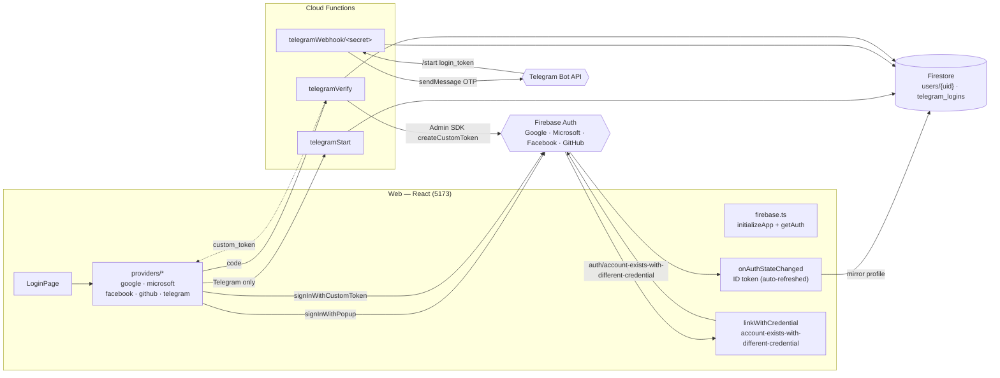
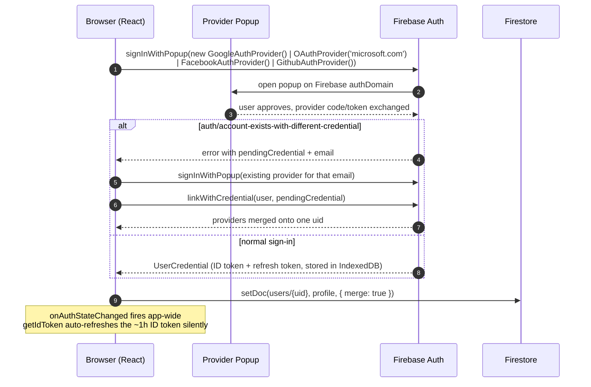
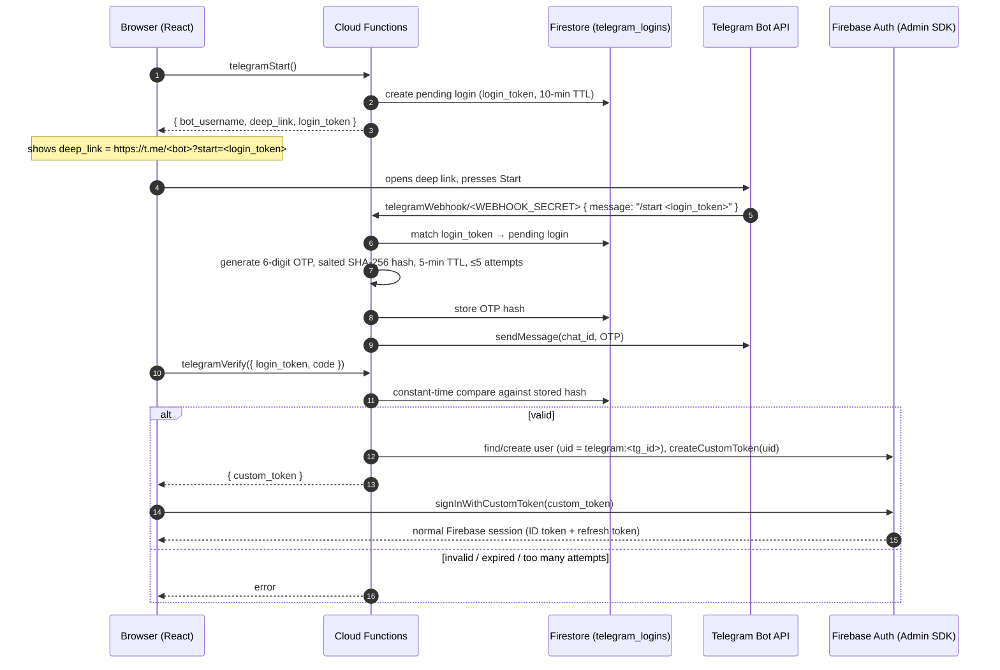
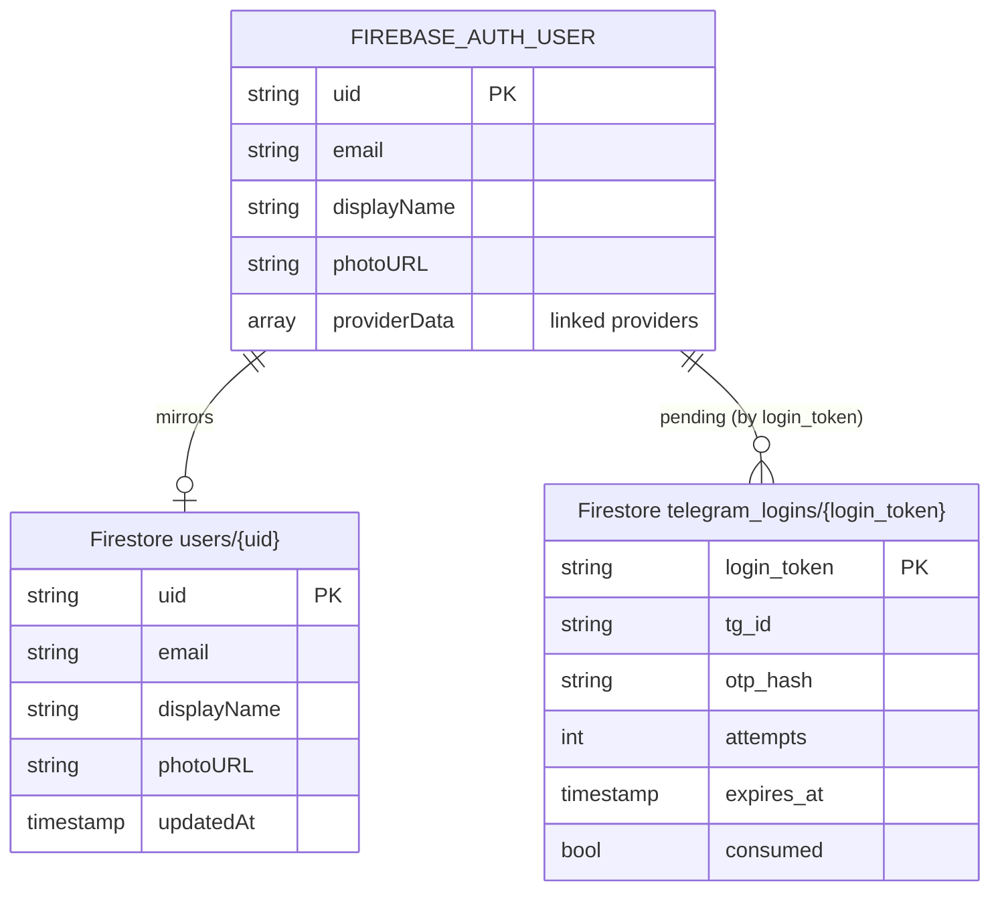

# Firebase-Driven OAuth — Architecture

**Module:** `firebase-driven/web/` (React) + `firebase-driven/functions/` (Cloud Functions)
**Ports:** Web `5173` — no API port; **Firebase is the backend**.

The **frontend drives OAuth directly against Firebase Auth** using the Firebase JS SDK's
`signInWithPopup`. There is **no custom backend for OAuth at all** — Firebase owns the
whole session (ID token + refresh token), and the SDK persists it in IndexedDB. The only
custom server-side code in this module is three **Cloud Functions** that implement
Telegram login, since Firebase has no native Telegram provider — they mint a **Firebase
custom token** that the client exchanges for a normal Firebase session.

---

## 1. Component Architecture

**No redirect/callback page.** Even GitHub — which needed a server-side code exchange in
`frontend-driven/` — is just `signInWithPopup(new GithubAuthProvider())` here: Firebase's
own `authDomain` handler performs the code exchange behind the popup.

**Libraries:** `firebase/app`, `firebase/auth`, `firebase/firestore` (web);
`firebase-admin`, `firebase-functions` (functions).

---

## 2. OAuth Flow — Popup providers (Google / Microsoft / Facebook / GitHub)

| Provider | Firebase provider class | Notes |
|----------|--------------------------|-------|
| **Google** | `GoogleAuthProvider` | |
| **Microsoft** | `OAuthProvider('microsoft.com')` | Tenant via `VITE_MICROSOFT_TENANT` (custom parameter) |
| **Facebook** | `FacebookAuthProvider` | |
| **GitHub** | `GithubAuthProvider` | Firebase's handler domain performs the code exchange — no app-side callback route |

---

## 3. Telegram — Cloud Functions + Firebase Custom Token

Firebase has no native Telegram provider, so this module implements the same bot-OTP idea
as the Go modules, but as three **Cloud Functions**, and it mints a **Firebase custom
token** instead of an app-specific JWT.

OTP is never logged. `telegram_logins` docs are also the durable store for pending
logins/OTPs — they survive a Cloud Functions cold start or redeploy, unlike an in-memory
map.

---

## 4. Session Model

Firebase **owns the entire session** — this module mints nothing of its own except the
one-shot Telegram custom token.

| Token | Minted by | Form | Expiry | Where it lives |
|-------|-----------|------|--------|-----------------|
| **ID token** | Firebase Auth | JWT | ~1 hour | IndexedDB (Firebase SDK), auto-refreshed by the SDK before use |
| **Refresh token** | Firebase Auth | opaque | long-lived (revocable) | IndexedDB (Firebase SDK), never touched by app code |
| **Custom token** (Telegram only) | `telegramVerify` (Admin SDK `createCustomToken`) | JWT | single use, minted just-in-time | Passed once from function to client, immediately exchanged via `signInWithCustomToken` and discarded |

> Contrast with `server-driven/` and `frontend-driven/`: there is **no app JWT, no
> `/refresh` endpoint, no `/logout` endpoint, no Postgres-backed refresh-token family**.
> `getIdToken()` and `signOut()` from the Firebase SDK replace all of that. Even the
> Telegram custom token isn't a session token — it's a one-time hand-off that Firebase
> immediately upgrades into its own ID/refresh token pair.

---

## 5. Data Model

- **Firebase Auth** is the identity source of truth (uid, linked provider credentials).
- **Firestore `users/{uid}`** is an app-writable profile mirror (for querying/joining app
  data — Firebase Auth itself isn't queryable from client code).
- **Firestore `telegram_logins`** holds only transient state for the bot-OTP handshake;
  documents are single-use and TTL'd.

No Postgres, no SQL migrations, anywhere in this module.

---

## 6. Endpoints (Cloud Functions)

OAuth (Google/Microsoft/Facebook/GitHub) has **no endpoints of its own** — the browser
talks straight to Firebase Auth via the SDK. Only Telegram needs custom server code:

| Function | Trigger | Auth | Purpose |
|----------|---------|------|---------|
| `telegramStart` | HTTPS callable/request | none | Mint login token, return `{ bot_username, deep_link, login_token }` |
| `telegramWebhook/<WEBHOOK_SECRET>` | HTTPS (Telegram webhook) | secret path segment | Receive `/start <login_token>`, generate + send OTP |
| `telegramVerify` | HTTPS callable/request | none | Validate `{ login_token, code }`, return `{ custom_token }` |

---

## 7. Key Env Vars

**Web (`VITE_*`):** `VITE_FIREBASE_API_KEY`, `VITE_FIREBASE_AUTH_DOMAIN`,
`VITE_FIREBASE_PROJECT_ID`, `VITE_FIREBASE_STORAGE_BUCKET`,
`VITE_FIREBASE_MESSAGING_SENDER_ID`, `VITE_FIREBASE_APP_ID`,
`VITE_GOOGLE_ENABLED` / `VITE_MICROSOFT_ENABLED` / `VITE_FACEBOOK_ENABLED` /
`VITE_GITHUB_ENABLED` / `VITE_TELEGRAM_ENABLED`, `VITE_MICROSOFT_TENANT`,
`VITE_TELEGRAM_FN_URL`.

**Functions:** `TELEGRAM_BOT_TOKEN`, `WEBHOOK_SECRET`.

> The `VITE_FIREBASE_*` values are **public by design** — they identify the Firebase
> project to the client SDK the same way a database hostname does; they are not secrets
> and are safe in a shipped bundle or a committed `.env.example`. Actual access control
> lives in Firebase Auth (which providers/domains are allowed) and Firestore security
> rules, not in hiding these keys. `TELEGRAM_BOT_TOKEN` and `WEBHOOK_SECRET` are the only
> real secrets in this module, and they live solely in the Cloud Functions environment —
> never shipped to the browser.

---

## 8. Server-Driven vs Frontend-Driven vs Firebase-Driven — at a glance

| | Server-Driven | Frontend-Driven | Firebase-Driven |
|--|---------------|------------------|------------------|
| Who runs OAuth | Backend redirects | Browser SDKs, backend validates | Browser, straight to Firebase Auth |
| Provider token seen by | Backend only | Browser, then sent to backend | Firebase (never touches our code) |
| Custom backend for OAuth | Go + Chi | Go (validate + issue JWT) | **none** |
| App access token | httpOnly cookie | in-memory Bearer | **Firebase ID token** (SDK-managed, IndexedDB) |
| Refresh token | httpOnly cookie, DB-tracked family | same | **Firebase-managed**, opaque, no app DB |
| Session store | PostgreSQL | PostgreSQL | **Firebase Auth + Firestore** (no Postgres) |
| Telegram | Go backend, in-memory OTP, long-polling | Go backend, in-memory OTP, long-polling | Cloud Functions, Firestore-backed OTP, **webhook** |
| Telegram issues | app JWT | app JWT | **Firebase custom token** → exchanged for normal session |
| Account linking | not applicable (one identity per login) | not applicable | native `linkWithCredential` on credential conflict |
| Ports | 8080 / 5173 | 8080 / 5173 | **5173 only** (no local API) |
| Local backend infra | Docker Postgres | Docker Postgres | **none** — real Firebase project, `firebase deploy` |

Shared by all three: the same four OAuth providers (Google, Microsoft, Facebook, GitHub)
plus Telegram as the one non-native flow, and the same two-channel OTP security model for
Telegram (login token in the browser, OTP only ever visible inside the user's Telegram
chat).
