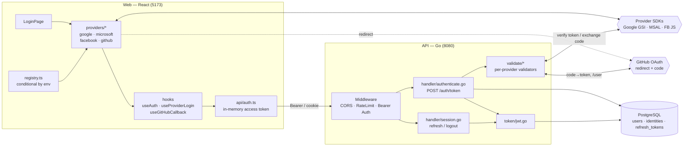
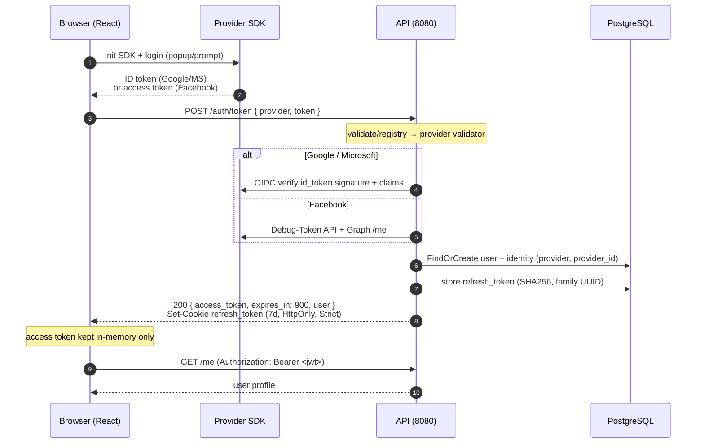
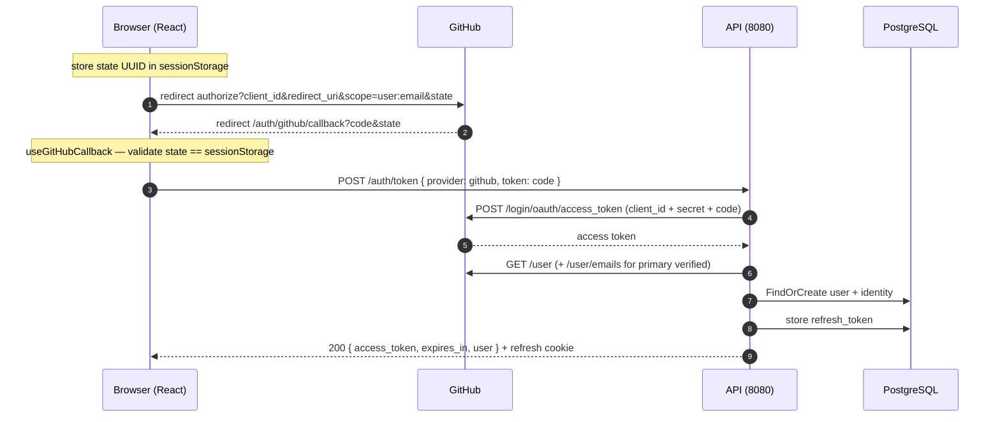
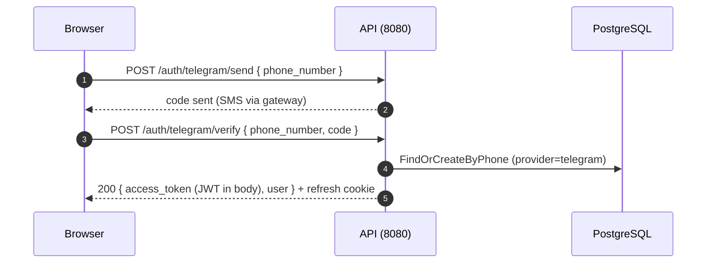
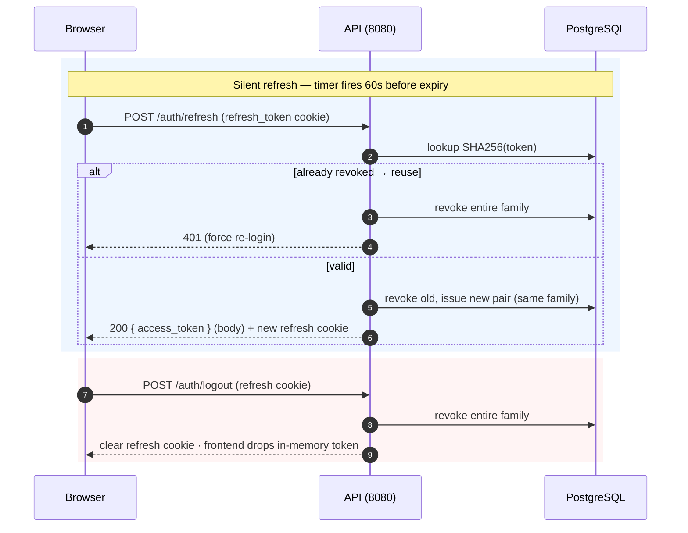
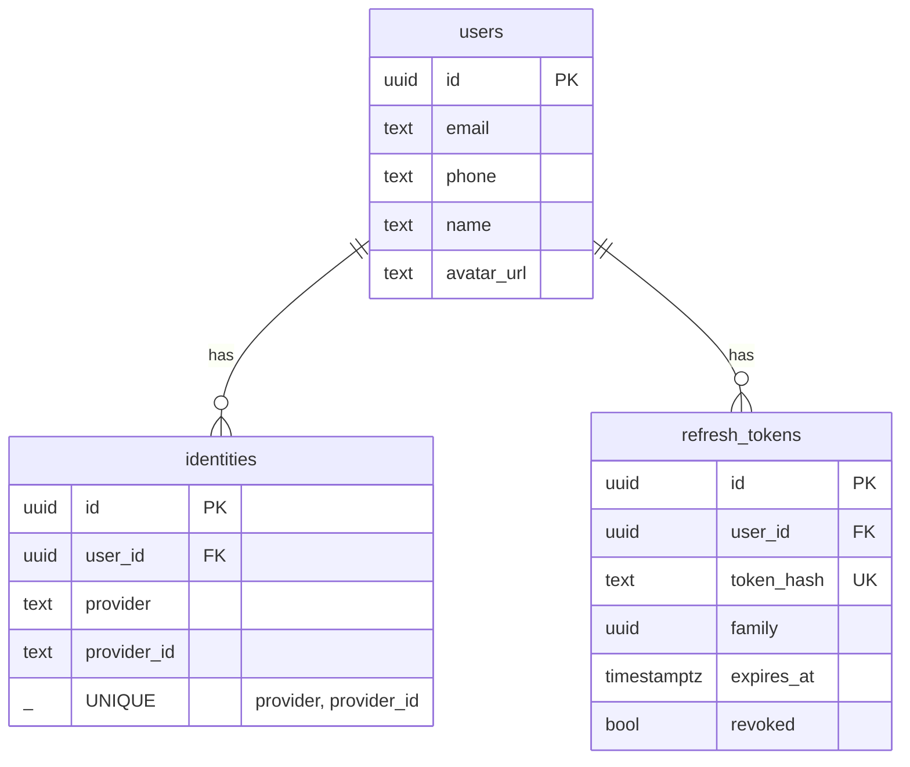

# Frontend-Driven OAuth — Architecture

**Module:** `frontend-driven/web/` (React) + `frontend-driven/api/` (Go)
**Ports:** API `8080`, Web `5173`

The **frontend drives OAuth** using provider JS SDKs. The backend does **not** redirect — it only **validates** whatever token/code the browser obtained and then **issues its own JWT**. The app's access token lives **in memory** (Bearer header); only the refresh token is a cookie.

---

## 1. Component Architecture

**Web providers register conditionally** (`registry.ts` + `config/providers.ts`): a provider only appears if its `VITE_*_CLIENT_ID` env var is set.

**Libraries:** `@azure/msal-browser` (Microsoft) · Google GSI · Facebook JS SDK · React Query. Backend uses `coreos/go-oidc/v3` for OIDC validation.

---

## 2. OAuth Flow — SDK providers (Google / Microsoft / Facebook)

The SDK returns a token in the browser; the browser POSTs it to the backend for validation.

| Provider | Browser obtains | Backend validates via |
|----------|-----------------|-----------------------|
| **Google** | ID token (GSI) | `go-oidc` verify |
| **Microsoft** | ID token (MSAL `loginPopup`, scopes `openid profile email`) | OIDC `login.microsoftonline.com/{tenant}/v2.0` |
| **Facebook** | access token (FB.login) | Debug-Token API + Graph `/me` |

---

## 3. OAuth Flow — GitHub (Authorization Code)

GitHub has no pure-JS SDK, so it uses a real redirect + **server-side code exchange** (the client secret never reaches the browser).

---

## 4. Telegram Phone Verification

Unlike the SDK providers, the JWT is returned **in the response body** (same as `/auth/token`), not via redirect.

---

## 5. Session: Refresh & Logout

`useAuth.ts`: schedules a refresh 60s before `expires_in`, and attempts a silent refresh on mount so a reload restores the session from the refresh cookie.

---

## 6. Tokens & Storage — the key contrast

| Token | Form | Expiry | Where it lives |
|-------|------|--------|----------------|
| **Access** | JWT HS256 (`sub`, `email`, `iat`, `exp`) | 15 min (`expires_in: 900`) | **In-memory JS variable** — sent as `Authorization: Bearer` |
| **Refresh** | 32-byte random | 7 days | `refresh_token` **httpOnly cookie**, `SameSite=Strict`, `Path=/`; **SHA256-hashed** in DB with a `family` UUID |

> No access-token cookie and no CSRF cookie here (server-driven has both). The access token being in-memory means a page reload relies on the silent refresh to re-issue it.

---

## 7. Data Model

---

## 8. Endpoints (API, port 8080)

| Method | Path | Auth | Purpose |
|--------|------|------|---------|
| POST | `/auth/token` | none | Validate provider token/code → issue JWT + refresh cookie |
| POST | `/auth/refresh` | refresh cookie | Rotate; return new JWT in body |
| POST | `/auth/logout` | refresh cookie | Revoke family, clear cookie |
| POST | `/auth/telegram/send` | none | Send SMS code |
| POST | `/auth/telegram/verify` | none | Verify → JWT in body |
| GET | `/me` | Bearer | Current user |
| GET | `/health` | none | Health check |

`middleware/auth.go` verifies the `Authorization: Bearer <jwt>` (HS256 signature + expiry) and injects `UserID`/`UserEmail` into context. `main.go` registers validators conditionally by config; CORS is scoped to the web origin; rate limit 10 req/s per IP.

---

## 9. Key Env Vars

**Web (`VITE_*`):** `GOOGLE_CLIENT_ID`, `MICROSOFT_CLIENT_ID`, `MICROSOFT_TENANT` (default `common`), `FACEBOOK_APP_ID`, `GITHUB_CLIENT_ID`, `GITHUB_REDIRECT_URI` (default `/auth/github/callback`).

**API:** `GOOGLE_CLIENT_ID/SECRET`, `MICROSOFT_CLIENT_ID/SECRET/TENANT`, `GITHUB_CLIENT_ID/SECRET`, `JWT_SECRET`, `COOKIE_DOMAIN`, `COOKIE_SECURE`, `FRONTEND_URL`.

---

## 10. Server-Driven vs Frontend-Driven — at a glance

| | Server-Driven | Frontend-Driven |
|--|---------------|-----------------|
| Who runs OAuth | Backend redirects | Browser SDKs |
| Provider token seen by | Backend only | Browser, then sent to backend |
| App access token | httpOnly cookie | **in-memory** Bearer |
| Refresh token | httpOnly cookie (Strict, `/`) | same |
| CSRF token | yes (double-submit) | not needed (Bearer, not cookie-auth) |
| GitHub | code exchange server-side | code exchange server-side (frontend redirects) |
| Ports | 8080 / 5173 | 8080 / 5173 |

Shared by both: HS256 JWT (15 min), 7-day rotated refresh tokens with **family-based reuse detection**, SHA256-hashed refresh storage, same `users`/`identities`/`refresh_tokens` schema, and OIDC signature verification for Google/Microsoft.
