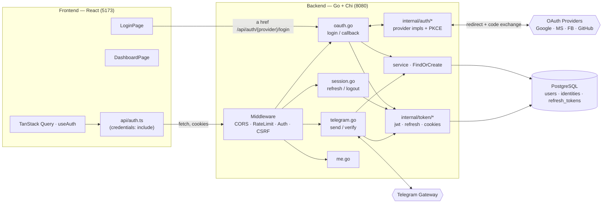
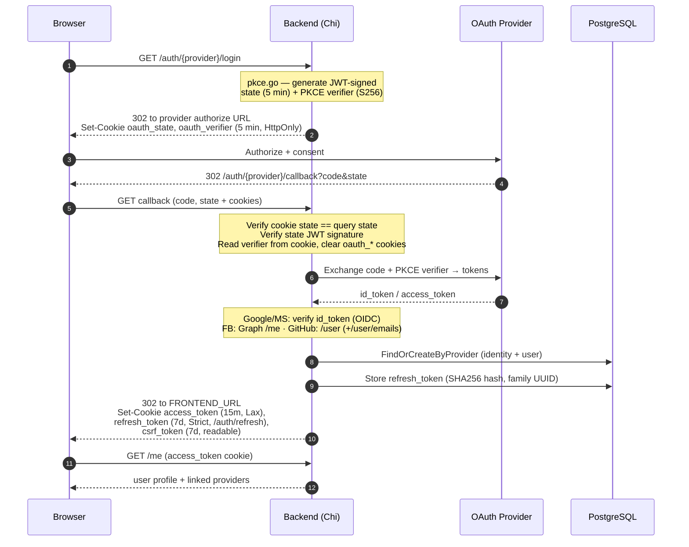
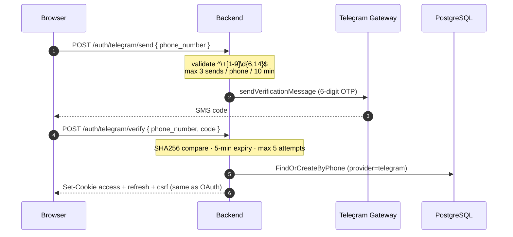
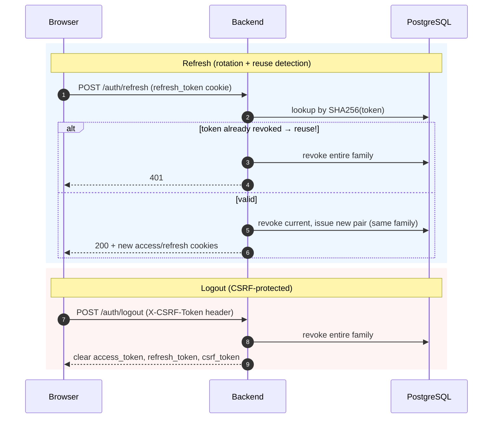
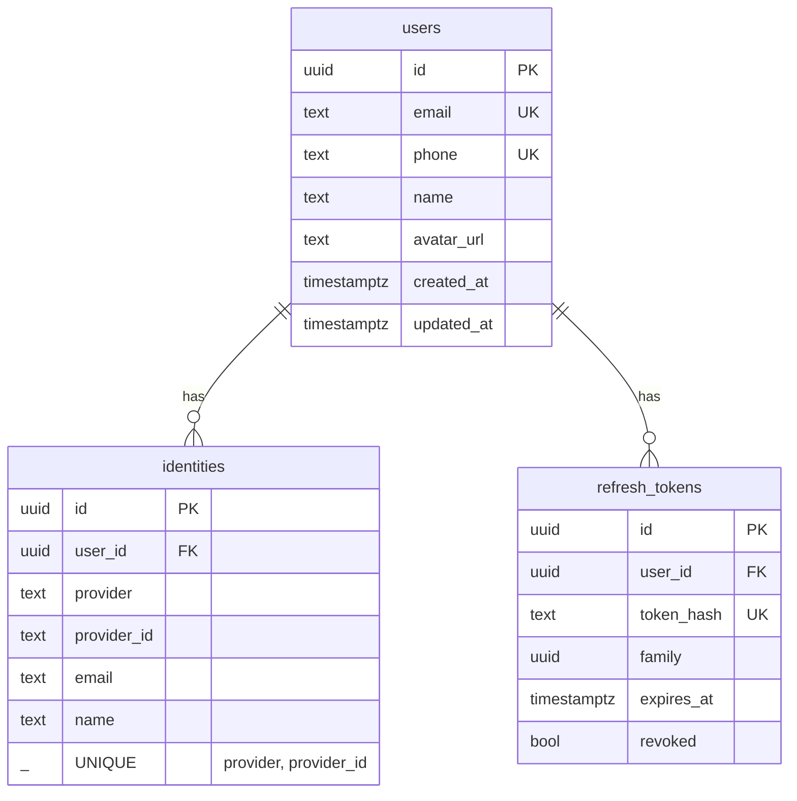

# Server-Driven OAuth — Architecture

**Module:** `backend/` (Go) + `frontend/` (React)
**Ports:** Backend `8080`, Frontend `5173`

The **backend owns the entire OAuth flow**. The browser only clicks a link; all redirects, PKCE, and code-for-token exchange happen server-side. The frontend never sees provider tokens or the app's JWT — everything is carried in **httpOnly cookies**.

---

## 1. Component Architecture



**Backend packages (`backend/internal/`):**

| Package | Responsibility |
|---------|----------------|
| `auth/` | Per-provider OAuth impls + `pkce.go` (state + PKCE verifier) |
| `config/` | Env var loading (`config.go`) |
| `database/` | sqlc-generated queries + models, migrations |
| `handler/` | HTTP handlers: `oauth`, `session`, `telegram`, `me` |
| `middleware/` | `auth` (cookie JWT), `csrf`, rate limiting |
| `service/` | `FindOrCreateByProvider`, `FindOrCreateByPhone` |
| `telegram/` | OTP gateway client |
| `token/` | JWT + refresh issuance + cookie helpers |

**Libraries:** Chi v5 (routing) · `golang.org/x/oauth2` (exchange + PKCE) · `coreos/go-oidc/v3` (ID token verify) · `golang-jwt/jwt/v5` (state signing) · pgxpool.

---

## 2. OAuth Login Flow (server-driven, PKCE)

Applies to Google, Microsoft, Facebook, GitHub. The browser is redirected the whole way; the app JWT lands as an httpOnly cookie.



**Per-provider specifics:**

| Provider | Verification | Notes |
|----------|-------------|-------|
| **Google** | OIDC `id_token` verify | scopes `openid profile email` |
| **Microsoft** | OIDC via `login.microsoftonline.com/{tenant}/v2.0` | `MICROSOFT_TENANT` (default `common`) |
| **Facebook** | Graph API `/me?fields=id,name,email,picture` | no id_token |
| **GitHub** | REST `/user`, falls back to `/user/emails` for primary verified email | no id_token |

---

## 3. Telegram Phone Verification



---

## 4. Session: Refresh & Logout



The frontend (`useAuth.ts`) retries `/auth/refresh` once on an auth failure, then re-queries `/me`.

---

## 5. Tokens & Cookies

| Token | Alg / Form | Expiry | Delivery | Storage |
|-------|-----------|--------|----------|---------|
| **Access** | JWT HS256 (`sub`, `email`, `iat`, `exp`) | 15 min | `access_token` cookie | not stored |
| **Refresh** | 32-byte hex random | 7 days | `refresh_token` cookie | **SHA256 hash** in DB + `family` UUID |
| **CSRF** | 16-byte hex | 7 days | `csrf_token` cookie | not stored |
| **OAuth state** | JWT HS256 | 5 min | `oauth_state` cookie | — |
| **PKCE verifier** | 32-byte base64url | 5 min | `oauth_verifier` cookie | — |

**Cookie attributes:**

| Cookie | HttpOnly | SameSite | Path | Secure |
|--------|----------|----------|------|--------|
| `access_token` | ✅ | Lax | `/` | config |
| `refresh_token` | ✅ | **Strict** | **`/auth/refresh`** | config |
| `csrf_token` | ❌ (JS reads it) | Lax | `/` | config |
| `oauth_state` / `oauth_verifier` | ✅ | Lax | `/` | config |

---

## 6. Data Model



`service.FindOrCreateByProvider`: return existing identity → else **auto-link by email** to an existing user → else create user + identity. Accessed via sqlc-generated queries (`queries/*.sql`).

---

## 7. Frontend Notes

- React 19 + Vite 8 + React Router v7 + TanStack Query v5.
- Vite dev proxy sends `/api/*` → `http://localhost:8080` (`vite.config.ts`).
- Every request uses `credentials: 'include'` so cookies flow.
- Login is just an `<a href="/api/auth/{provider}/login">` (`OAuthButton.tsx`) — no JS SDKs.
- `useAuth` keys off `['me']`, `staleTime` 5 min; logout sends the `X-CSRF-Token` header read from the `csrf_token` cookie.

---

## 8. Key Env Vars (Backend)

```
DATABASE_URL · SERVER_PORT (8080) · FRONTEND_URL (5173)
COOKIE_DOMAIN · COOKIE_SECURE · JWT_SECRET (required)
GOOGLE_CLIENT_ID/SECRET · MICROSOFT_CLIENT_ID/SECRET/TENANT
FACEBOOK_CLIENT_ID/SECRET · GITHUB_CLIENT_ID/SECRET · TELEGRAM_API_TOKEN
```

---

## 9. Security Summary

PKCE S256 on all providers · JWT-signed 5-min state · refresh rotation with **family-based reuse detection** (cascade revoke) · httpOnly access+refresh cookies · SameSite=Strict + path-scoped refresh cookie · CSRF double-submit for mutations · rate limits (10 req/s IP; 3 Telegram sends / phone / 10 min) · short expiries · OIDC signature verification for Google/MS.
